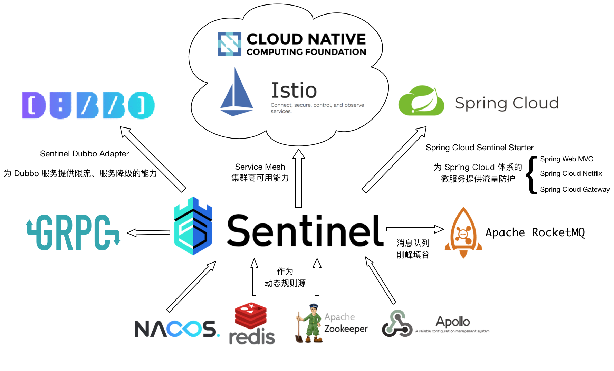

# Spring Cloud Alibaba（三）Sentinel之熔断降级

本项目演示如何使用 Sentinel 完成 Spring Cloud 应用的熔断降级调用。

Sentinel 是阿里巴巴开源的分布式系统的流量防卫组件，Sentinel 把流量作为切入点，从流量控制，熔断降级，系统负载保护等多个维度保护服务的稳定性。

OpenFeign是一款声明式、模板化的HTTP客户端， Feign可以帮助我们更快捷、优雅地调用HTTP API，需要了解OpenFeign使用基础，可以参考[cloud-feign示例源码](https://github.com/smltq/spring-boot-demo/blob/master/cloud-feign)。

本项目服务注册中心使用nacos，服务提供者使用[Spring Cloud Alibaba（一） 如何使用nacos服务注册和发现](https://github.com/smltq/spring-boot-demo/blob/master/cloud-alibaba/README1.md)创建的ali-nacos-provider服务

## Sentinel介绍

随着微服务的流行，服务和服务之间的稳定性变得越来越重要。Sentinel 以流量为切入点，从流量控制、熔断降级、系统负载保护等多个维度保护服务的稳定性。

Sentinel 具有以下特征:

- 1.丰富的应用场景

Sentinel 承接了阿里巴巴近 10 年的双十一大促流量的核心场景，例如秒杀（即突发流量控制在系统容量可以承受的范围）、消息削峰填谷、集群流量控制、实时熔断下游不可用应用等。
    
- 2.完备的实时监控

Sentinel 同时提供实时的监控功能。您可以在控制台中看到接入应用的单台机器秒级数据，甚至 500 台以下规模的集群的汇总运行情况。

- 3.广泛的开源生态

Sentinel 提供开箱即用的与其它开源框架/库的整合模块，例如与 Spring Cloud、Dubbo、gRPC 的整合。您只需要引入相应的依赖并进行简单的配置即可快速地接入 Sentinel。

- 4.完善的 SPI 扩展点

Sentinel 提供简单易用、完善的 SPI 扩展接口。您可以通过实现扩展接口来快速地定制逻辑。例如定制规则管理、适配动态数据源等。

### Sentinel 分为两个部分

- 核心库（Java 客户端）不依赖任何框架/库，能够运行于所有 Java 运行时环境，同时对 Dubbo / Spring Cloud 等框架也有较好的支持。
- 控制台（Dashboard）基于 Spring Boot 开发，打包后可以直接运行，不需要额外的 Tomcat 等应用容器。

### Sentinel主要特性


### Sentinel开源生态



## 熔断降级

对调用链路中不稳定的资源进行熔断降级是保障高可用的重要措施之一。由于调用关系的复杂性，如果调用链路中的某个资源不稳定，最终会导致请求发生堆积。Sentinel 熔断降级会在调用链路中某个资源出现不稳定状态时（例如调用超时或异常比例升高），对这个资源的调用进行限制，让请求快速失败，避免影响到其它的资源而导致级联错误。当资源被降级后，在接下来的降级时间窗口之内，对该资源的调用都自动熔断（默认行为是抛出 DegradeException）

### 降级策略

- 平均响应时间 (DEGRADE_GRADE_RT)：当 1s 内持续进入 5 个请求，对应时刻的平均响应时间（秒级）均超过阈值（count，以 ms 为单位），那么在接下的时间窗口（DegradeRule 中的 timeWindow，以 s 为单位）之内，对这个方法的调用都会自动地熔断（抛出 DegradeException）。
- 异常比例 (DEGRADE_GRADE_EXCEPTION_RATIO)：当资源的每秒请求量 >= 5，并且每秒异常总数占通过量的比值超过阈值（DegradeRule 中的 count）之后，资源进入降级状态。
- 异常数 (DEGRADE_GRADE_EXCEPTION_COUNT)：当资源近 1 分钟的异常数目超过阈值之后会进行熔断。

## 熔断降级代码实现

### 服务提供方

创建ali-nacos-provider项目

1. 首先， 依赖nacos 注册中心

```xml
<dependency>
    <groupId>com.alibaba.cloud</groupId>
    <artifactId>spring-cloud-starter-alibaba-nacos-discovery</artifactId>
</dependency>
```

2. 定义服务提供方接口

```java
@RestController
@Slf4j
public class HelloController {
    @GetMapping(value = "/hello/{str}", produces = "application/json")
    public String hello(@PathVariable String str) {
        log.info("-----------收到消费者请求-----------");
        log.info("收到消费者传递的参数：" + str);
        String result = "我是服务提供者，见到你很高兴==>" + str;
        log.info("提供者返回结果：" + result);
        return result;
    }
}
```

### 服务提消费方

创建ali-nacos-sentinel-feign项目

1.首先，pom.xml添加依赖

```xml
    <dependencies>
        <dependency>
            <groupId>org.springframework.boot</groupId>
            <artifactId>spring-boot-starter-web</artifactId>
        </dependency>

        <dependency>
            <groupId>com.alibaba.cloud</groupId>
            <artifactId>spring-cloud-starter-alibaba-nacos-discovery</artifactId>
        </dependency>

        <dependency>
            <groupId>org.springframework.boot</groupId>
            <artifactId>spring-boot-starter-actuator</artifactId>
        </dependency>

        <dependency>
            <groupId>org.springframework.cloud</groupId>
            <artifactId>spring-cloud-starter-openfeign</artifactId>
        </dependency>

        <dependency>
            <groupId>com.alibaba.cloud</groupId>
            <artifactId>spring-cloud-starter-alibaba-sentinel</artifactId>
        </dependency>

    </dependencies>
```

2.定义FeignClient,及其降级配置

- 定义FeignClient

```java
package com.easy.ansFeign.service;

import com.easy.ansFeign.fallback.HelloServiceFallbackFactory;

import org.springframework.cloud.openfeign.FeignClient;
import org.springframework.web.bind.annotation.GetMapping;
import org.springframework.web.bind.annotation.PathVariable;

@FeignClient(name = "ali-nacos-provider", fallbackFactory = HelloServiceFallbackFactory.class)
public interface HelloService {

    /**
     * 调用服务提供方的输出接口.
     *
     * @param str 用户输入
     * @return hello result
     */
    @GetMapping("/hello/{str}")
    String hello(@PathVariable("str") String str);
}

```

- 定义fallback 工厂，获取异常

```java
@Component
public class HelloServiceFallbackFactory implements FallbackFactory<HelloServiceFallback> {

    @Override
    public HelloServiceFallback create(Throwable throwable) {
        return new HelloServiceFallback(throwable);
    }
}

```

- 定义具体的fallback 实现

```java
public class HelloServiceFallback implements HelloService {

    private Throwable throwable;

    HelloServiceFallback(Throwable throwable) {
        this.throwable = throwable;
    }

    /**
     * 调用服务提供方的输出接口.
     *
     * @param str 用户输入
     * @return
     */
    @Override
    public String hello(String str) {
        return "服务调用失败，降级处理。异常信息：" + throwable.getMessage();
    }
}

```

- 测试入口

```java
@RestController
public class TestController {

    @Autowired
    private HelloService helloService;

    @GetMapping("/hello-feign/{str}")
    public String feign(@PathVariable String str) {
        return helloService.hello(str);
    }
}
```

## 使用示例

### 示例关联项目

在[Spring Cloud Alibaba（一） 如何使用nacos服务注册和发现](README1.md)基础上，我们新建了ali-nacos-sentinel-feign项目，并调用ali-nacos-provider项目用作该示例的服务提供方，有以下二个项目做测试。
        
- ali-nacos-provider：服务提供者，服务名：ali-nacos-provider，端口：9000

- ali-nacos-sentinel-feign：服务消费者，服务名：ali-nacos-sentinel-feign，端口：9102

### 运行示例测试

首先要启动服务注册中心 nacos、ali-nacos-provider服务及ali-nacos-sentinel-feign服务

- 访问地址： http://localhost:9102/hello-feign/yuntian

返回
```json
我是服务提供者，见到你很高兴==>yuntian
```
表示我们的服务成功调用到了

- 关闭ali-nacos-provider服务，访问： http://localhost:9102/hello-feign/yuntian

返回
```json
服务调用失败，降级处理。异常信息：com.netflix.client.ClientException: Load balancer does not have available server for client: ali-nacos-provider
```
表示执行了我们预定的回调，服务成功降级了。

### 资料

- [Spring Cloud Alibaba Sentinel 示例源码](https://github.com/smltq/spring-boot-demo/blob/master/cloud-alibaba)
- [原文地址](https://github.com/smltq/spring-boot-demo/blob/master/cloud-alibaba/README3.md)
- [Sentinel GitHub](https://github.com/alibaba/Sentinel)